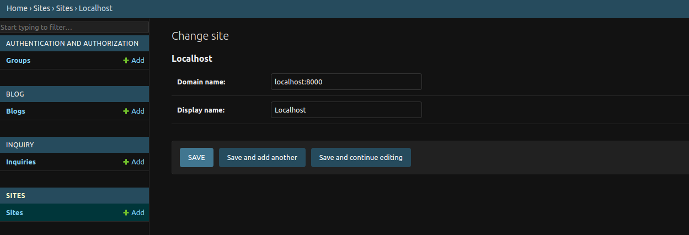

# Django SaaS Boilerplate (production ready)
Focus on building your core functionality, skip writing repetitive code. Comes packed with landing page, Payment integration, blog, User model, sitemap and more.

### Why use Django SaaS boilerplate?
Using a Django saas boilerplate can save you a lot of time, which is a huge benefit. Most customers don't care if you start from scratch or use a template; they just want their problem solved quickly. Whether you use Django or another framework usually doesn't matter to them as long as the job gets done efficiently.

This boilerplate can help you save hours of work, allowing you to focus on core functionality of your  SaaS instead of spending a lot of time on setting up stripe, blog, login functionalities and landing page.

**#CodeLessShipMore**

### Want to help me write more open-source?

Consider buying me a coffee

[](https://ko-fi.com/L3L612WN7K)

### who is this boilerplate suitable for?
* Reduce repetitive parts and focus on functionality.
* For people building an MVP(minimum viable product) and trying to ship as quickly as possible.
* People looking to learn Django.
* People who just finished building core functionality and are looking to integrate landing page, blog, payment etc.

### What features does Django template include?
- [x] **Production ready**: you can immediately deploy this to cloud such as Vercel, Railway.app, Render.com etc.
- [x] Comes with a default landing page that you can modify, for more landing pages visit [Awesome landing pages](https://github.com/PaulleDemon/awesome-landing-pages).
- [x] **Responsive design**: forget about making things responsive yourself, as it includes responsive `base.html`, you can extend from.
- [x] **Pricing page**: Comes with a basic pricing page you can modify
- [x] **Postgres DB ready**: Comes with postgres Db configuration for production
- [x] **ESP**: use transactional emails at scale (sending email notifications)
- [x] **Modern admin:** uses unfold admin module.
- [x] **Payment integration:** Default Stripe integration, just add your stripe keys and get started
- [x] Recurring charges
- [x] **Custom user model:** Easily modify the user model.
- [x] **Login and Signup flow:** Including, verification email, resend token, password reset.
- [x] **Blog:** Has blog with Trix WYSIWYG editor built into the admin panel.
- [x] **Contact us:** Contact page and model to manage customer enquires.
- [x] 404 page
- [x] Technical SEO optimization.
- [x] Dynamic Sitemap.xml
- [x] Robots.txt
- [x] Google analytics
- [x] **Django storages:** Storage integration for production (default Google Object storage)
- [x] **Tailwind css:** setup for rapid development (note: the tailwind classes are prefixed with `tw-`, to differentiate them)
- [ ] **CLI Wizard:** Customize your setup with CLI wizard (upcoming)

### Demo
Visit the demo site: [Django Demo website](https://django-saas-boilerplate.vercel.app/)

For admin and login use.
```
demo@mail.com
demo123*
```
>[!NOTE]
> You will not receive any confirmation email upon signup as its disabled, use the above account to login to admin dashboard

For testing stripe check out test cards: https://docs.stripe.com/testing

### Other templates
**Basic non-saas website template:** [Django boilerplate](https://github.com/PaulleDemon/Django-website-template)

**Free and opensource landing pages:** [Free landing pages](https://github.com/PaulleDemon/awesome-landing-pages)

### Django developer
I fund open-source by providing custom works, so if you are looking for django developer to supercharge your development contact [here](https://tally.so/r/woO0Kx)

### Table of contents

- [Why use Django website boilerplate?](#why-use-django-website-boilerplate)
- [What features does Django template include?](#what-features-does-django-template-include)

- [Demo](#demo)

- [Local development](#local-development)
  - [Admin superuser](#admin-superuser)
  - [changing example.com to localhost/yourdomain](#changing-examplecom-to-localhostyourdomain)
- [Customizing](#customizing)
  - [Adding title, description to page](#adding-title-description-to-page)
- [Payment - Stripe](#payment---stripe)
- [Deployment:](#deployment)
  - [Create a firebase credential file](#create-a-firebase-credential-file)
  - [Deploying credential file to production](#deploying-credential-file-to-production)
- [Tutorials](#tutorials)

## Local development

follow the below steps :
1. Star the repo: https://github.com/PaulleDemon/Django-SAAS-Boilerplate
   
2. Clone the repo
`git clone https://github.com/PaulleDemon/Django-SAAS-Boilerplate`

3. Install python 3.8 or above.
https://www.python.org/downloads/

4. Open the template folder and from the terminal change the
directory to the current working directory.
`cd home/Template`

5. Install dependencies in an environment (creating an
enviornment is optional, but recommended)
```
pip install -r requirements.txt
```

6. Add a `.env` file inside the `project` folder with the following
```py
DEBUG=1
PYTHON_VERSION=3.10
DOMAIN=""

ALLOWED_HOSTS=".up.railway.app"
ALLOWED_CORS=""

SECRET_KEY=""
PORD_SECRET_KEY=""

DJANGO_SUPERUSER_EMAIL="" # optonal use if you want to create supruser using --noinput
DJANGO_SUPERUSER_PASSWORD="" # optonal use if you want to create supruser using --noinput

EMAIL_HOST="smtpout.server.net"
EMAIL_HOST_USER=""
EMAIL_HOST_PASSWORD=""

POSTGRES_DATABASE=""
POSTGRES_USER=""
POSTGRES_PASSWORD=""
POSTGRES_HOST=""

POSTGRES_URL=""

PROJECT_ID="" # firebase project id
BUCKET_NAME=".appspot.com" # firebase storage name
FIREBASE_CRED_PATH="project/firebase-cred.json"

FIREBASE_ENCODED=""
CLOUD_PLATFORM="RAILWAY"

GOOGLE_ANALYTICS="G-"

STRIPE_TEST_API_KEY=""
STRIPE_WEBHOOK_TEST_API_KEY=""
STRIPE_PUB_TEST_KEY=""

STRIPE_PROD_API_KEY=""
STRIPE_WEBHOOK_PROD_API_KEY=""
STRIPE_PUB_PROD_KEY=""
```

7. Now in your terminal Create databases and Tables using
```
python manage.py migrate
```
Your database is created and ready to use.

8. Now run the website from the terminal using.
```py
python manage.py runserver
```
Your website should be available at: http://localhost:8000/

9. To run Tailwind CSS open a new terminal and run
```py
python manage.py tailwind start
```

**Note:** If you are facing problems starting this program in windows OS, remove logging from project/settings.py

### Admin superuser
To create a admin superuser use the following in terminal
```py
python manage.py createsuperuser
```

### changing example.com to localhost/yourdomain
If you are sending reset email you may notice its being sent from example.com, inorder to 
change that you need to go to admin dashboard and from sites, change to your domain



## Customizing

All html, css, js and assets lies inside the templates.
- To modify the landing page, update `home.html`.
- To add link to header and footer or modify head tags, check `base.html`.
- extend `base.html` to have the same footer and header.

### Adding title, description to page
To add title and meta tags to a page use the following tags
```py
lorem impsum 
lorem impsum #meta description

{{blog.title}} |  # open graph title, for socials
{{blog.meta_description}} # open graph description, for socials
article
 # social image
```

To add additional head tags

```py
lorem impsum 
```
To add scripts at the end of the elements
```

    <script src="" />

```

### Payment - Stripe
By default it is set up to use Stripe you can however change this to use other 
payment gateways supported by django-payments. 

> [!CAUTION]  
> Don't make payment to your self in production, as this goes against Stripe terms of use. Use only stripe test account for testing purposes.

You can get the stripe test account secret key, public key and webhook key from stripe dashboard.

* To forward webhook request to local development follow the stripe guide: https://docs.stripe.com/webhooks#local-listener

## Deployment:

You can make use of Railway to deploy your own instance. 

<a href="https://railway.app?referralCode=BfMDHP">
  
</a>

Link to deploy to [Railway.app](https://railway.app?referralCode=BfMDHP)

once you complete make sure to 
```
python manage.py collectstatic
```
and set
```
DEBUG=0
```
**Generate secret key**
To generate secret key use `from django.core.management.utils import get_random_secret_key` then `get_random_secret_key()` in your python shell

**Note:** Don't forget to set the sites to your domain instead of example.com in the admin panel

> [!NOTE]  
> Make sure to add webhook endpoint during production via stripe, other wise you may not get the confirmations

### Create a firebase credential file

> [!NOTE] 
We'll be using firebase for persistent storage, to upload user files. Firebase is pre-configured as there are other firebase services developers may want to use. <br><br> You can also use any of the storage supported by [django-storages](https://github.com/jschneier/django-storages), if you don't want to use firebase.

To use Firebase

1. We use Google storage for storing files. Go to firebase -> storage -> create (make it public)

2. Now Go to firebase -> project settings -> service account -> Generate new private key.

Rename the private as `firebase-cred.json`

Use this private file as your credential file.

#### Deploying credential file to production
Sometimes your cloud provider may not provide you with storage for secret files. 
So convert the credential file to base64 using
```
base64 firebase-cred.json > encoded.txt
```
Now copy the contents of encoded.txt and paste it in `FIREBASE_ENCODED="wedde"` variable

### Tutorials
  #### Looking to learn about adding payment to Django?
  Check out this blog about [adding payment to django](https://dev.to/paul_freeman/adding-payment-to-django-app-4cc9). This should give you an overview about adding payments to Django.

  #### Adding ESP
  Check out this blog on adding ESP to help you supercharge [transactional emails](https://dev.to/paul_freeman/adding-esp-to-supercharge-your-django-email-4jkp)

  #### Deploying to Vercel
  Check out this blog for vercel deployment help [Django vercel deployment](https://dev.to/paul_freeman/deploying-django-website-to-vercel-19ed)

## Images credits
Images are taken from free to use sites such as 
1. unsplash - https://unsplash.com/
2. Pexels - https://www.pexels.com/
